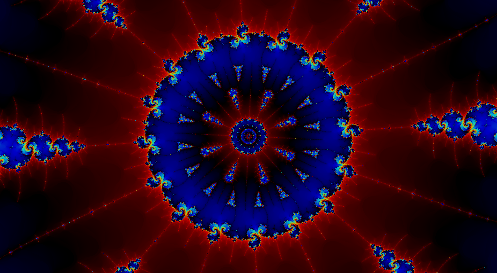

# CUDA-Fractals

*Student project*

CUDA-accelerated deep zooming into Mandelbrot and Julia using [perturbation theory](http://www.science.eclipse.co.uk/sft_maths.pdf).

# Requirements
- GCC
- GNU Make
- NVCC
- OpenGL
- OpenMP
# Compiling & Usage
```sh
make release && ./bin/main
```
# Media
|
-|-
|